# RoboCleanerBuddy - Use Case Diagram

## Overview
This document contains the complete use case diagram for the RoboCleanerBuddy application, a robot cleaning management system.

---

## Actors

1. **Guest** - Unauthenticated user
2. **User** - Regular authenticated user
3. **Admin** - Administrator with full system access
4. **System** - Automated system processes

---

## Use Case Diagram (PlantUML Format)

```plantuml
@startuml RoboCleanerBuddy_UseCaseDiagram
!theme plain
skinparam actorStyle awesome
skinparam useCase {
  BackgroundColor #1A1F3A
  BorderColor #00D9FF
  FontColor #E8E8E8
}
skinparam actor {
  BackgroundColor #0A0E27
  BorderColor #00D9FF
  FontColor #E8E8E8
}

left to right direction

actor Guest
actor User
actor Admin
actor System

package "Authentication & Account Management" {
  usecase "Sign Up" as UC1
  usecase "Sign In (Email/Password)" as UC2
  usecase "Sign In (Google)" as UC3
  usecase "Sign In (Facebook)" as UC4
  usecase "Sign Out" as UC5
  usecase "Forgot Password" as UC6
  usecase "Reset Password" as UC7
  usecase "Email Verification" as UC8
  usecase "View Profile" as UC9
  usecase "Update Profile" as UC10
  usecase "Change Password" as UC11
  usecase "Remember Me" as UC12
}

package "User Dashboard" {
  usecase "View Dashboard" as UC13
  usecase "View Robot Status" as UC14
  usecase "View Cleaning History" as UC15
  usecase "View Schedules" as UC16
  usecase "View Notifications" as UC17
  usecase "View Settings" as UC18
}

package "Robot Control & Monitoring" {
  usecase "Control Robot" as UC19
  usecase "Start Cleaning" as UC20
  usecase "Stop Cleaning" as UC21
  usecase "Return to Base" as UC22
  usecase "Monitor Robot Status" as UC23
  usecase "View Battery Level" as UC24
  usecase "View Connection Status" as UC25
}

package "Admin - User Management" {
  usecase "View All Users" as UC26
  usecase "Add User" as UC27
  usecase "Edit User" as UC28
  usecase "Delete User" as UC29
  usecase "Activate User" as UC30
  usecase "Deactivate User" as UC31
  usecase "Search Users" as UC32
  usecase "Filter Users" as UC33
}

package "Admin - Robot Management" {
  usecase "View All Robots" as UC34
  usecase "Add Robot" as UC35
  usecase "Edit Robot" as UC36
  usecase "Delete Robot" as UC37
  usecase "Monitor Robot Status" as UC38
  usecase "Control Robot Remotely" as UC39
  usecase "View Robot Details" as UC40
}

package "Admin - Schedule Management" {
  usecase "View All Schedules" as UC41
  usecase "Create Schedule" as UC42
  usecase "Edit Schedule" as UC43
  usecase "Delete Schedule" as UC44
  usecase "Assign Robot to Schedule" as UC45
  usecase "Set Recurring Schedule" as UC46
  usecase "Enable/Disable Schedule" as UC47
  usecase "View Schedule History" as UC48
}

package "Reports & Issues" {
  usecase "Create Report" as UC49
  usecase "View Reports" as UC50
  usecase "Reply to Report" as UC51
  usecase "Resolve Report" as UC52
  usecase "Archive Report" as UC53
  usecase "View Report History" as UC54
}

package "Admin - Notifications" {
  usecase "View All Notifications" as UC55
  usecase "Send Notification" as UC56
  usecase "Mark Notification as Read" as UC57
  usecase "Filter Notifications" as UC58
}

package "Admin - Analytics & Logs" {
  usecase "View Dashboard Analytics" as UC59
  usecase "View System Logs" as UC60
  usecase "View Audit Trail" as UC61
  usecase "Filter Logs" as UC62
  usecase "Search Logs" as UC63
  usecase "Export Logs" as UC64
  usecase "View Statistics" as UC65
}

package "Admin - Reports & Analytics" {
  usecase "Generate Reports" as UC66
  usecase "Export Reports" as UC67
  usecase "View Analytics Charts" as UC68
  usecase "View Usage Trends" as UC69
}

package "Admin - Settings" {
  usecase "View System Settings" as UC70
  usecase "Configure Connectivity" as UC71
  usecase "Manage Robot Configurations" as UC72
  usecase "Admin Recovery" as UC73
}

package "System Processes" {
  usecase "Log User Actions" as UC74
  usecase "Log Admin Actions" as UC75
  usecase "Log Robot Actions" as UC76
  usecase "Send Email Notifications" as UC77
  usecase "Track Security Events" as UC78
  usecase "Monitor System Health" as UC79
}

' Guest associations
Guest --> UC1
Guest --> UC2
Guest --> UC3
Guest --> UC4
Guest --> UC6

' User associations
User --> UC5
User --> UC7
User --> UC8
User --> UC9
User --> UC10
User --> UC11
User --> UC12
User --> UC13
User --> UC14
User --> UC15
User --> UC16
User --> UC17
User --> UC18
User --> UC19
User --> UC20
User --> UC21
User --> UC22
User --> UC23
User --> UC24
User --> UC25
User --> UC49
User --> UC50
User --> UC54

' Admin associations
Admin --> UC5
Admin --> UC7
Admin --> UC8
Admin --> UC9
Admin --> UC10
Admin --> UC11
Admin --> UC12
Admin --> UC13
Admin --> UC14
Admin --> UC15
Admin --> UC16
Admin --> UC17
Admin --> UC18
Admin --> UC19
Admin --> UC20
Admin --> UC21
Admin --> UC22
Admin --> UC23
Admin --> UC24
Admin --> UC25
Admin --> UC26
Admin --> UC27
Admin --> UC28
Admin --> UC29
Admin --> UC30
Admin --> UC31
Admin --> UC32
Admin --> UC33
Admin --> UC34
Admin --> UC35
Admin --> UC36
Admin --> UC37
Admin --> UC38
Admin --> UC39
Admin --> UC40
Admin --> UC41
Admin --> UC42
Admin --> UC43
Admin --> UC44
Admin --> UC45
Admin --> UC46
Admin --> UC47
Admin --> UC48
Admin --> UC50
Admin --> UC51
Admin --> UC52
Admin --> UC53
Admin --> UC54
Admin --> UC55
Admin --> UC56
Admin --> UC57
Admin --> UC58
Admin --> UC59
Admin --> UC60
Admin --> UC61
Admin --> UC62
Admin --> UC63
Admin --> UC64
Admin --> UC65
Admin --> UC66
Admin --> UC67
Admin --> UC68
Admin --> UC69
Admin --> UC70
Admin --> UC71
Admin --> UC72
Admin --> UC73

' System associations
System --> UC74
System --> UC75
System --> UC76
System --> UC77
System --> UC78
System --> UC79

' Extend relationships
UC6 ..> UC7 : <<extend>>
UC8 ..> UC2 : <<extend>>
UC42 ..> UC45 : <<include>>
UC49 ..> UC50 : <<extend>>
UC60 ..> UC61 : <<extend>>
UC66 ..> UC67 : <<extend>>

@enduml
```

---

## Use Case Diagram (Mermaid Format - Alternative)

```mermaid
graph TB
    subgraph Actors
        Guest[Guest]
        User[User]
        Admin[Admin]
        System[System]
    end

    subgraph Auth["Authentication & Account Management"]
        UC1[Sign Up]
        UC2[Sign In Email/Password]
        UC3[Sign In Google]
        UC4[Sign In Facebook]
        UC5[Sign Out]
        UC6[Forgot Password]
        UC7[Reset Password]
        UC8[Email Verification]
        UC9[View Profile]
        UC10[Update Profile]
        UC11[Change Password]
        UC12[Remember Me]
    end

    subgraph UserDash["User Dashboard"]
        UC13[View Dashboard]
        UC14[View Robot Status]
        UC15[View Cleaning History]
        UC16[View Schedules]
        UC17[View Notifications]
        UC18[View Settings]
    end

    subgraph Robot["Robot Control & Monitoring"]
        UC19[Control Robot]
        UC20[Start Cleaning]
        UC21[Stop Cleaning]
        UC22[Return to Base]
        UC23[Monitor Robot Status]
        UC24[View Battery Level]
        UC25[View Connection Status]
    end

    subgraph AdminUser["Admin - User Management"]
        UC26[View All Users]
        UC27[Add User]
        UC28[Edit User]
        UC29[Delete User]
        UC30[Activate User]
        UC31[Deactivate User]
        UC32[Search Users]
        UC33[Filter Users]
    end

    subgraph AdminRobot["Admin - Robot Management"]
        UC34[View All Robots]
        UC35[Add Robot]
        UC36[Edit Robot]
        UC37[Delete Robot]
        UC38[Monitor Robot Status]
        UC39[Control Robot Remotely]
        UC40[View Robot Details]
    end

    subgraph AdminSchedule["Admin - Schedule Management"]
        UC41[View All Schedules]
        UC42[Create Schedule]
        UC43[Edit Schedule]
        UC44[Delete Schedule]
        UC45[Assign Robot to Schedule]
        UC46[Set Recurring Schedule]
        UC47[Enable/Disable Schedule]
        UC48[View Schedule History]
    end

    subgraph Reports["Reports & Issues"]
        UC49[Create Report]
        UC50[View Reports]
        UC51[Reply to Report]
        UC52[Resolve Report]
        UC53[Archive Report]
        UC54[View Report History]
    end

    subgraph AdminNotif["Admin - Notifications"]
        UC55[View All Notifications]
        UC56[Send Notification]
        UC57[Mark as Read]
        UC58[Filter Notifications]
    end

    subgraph AdminLogs["Admin - Analytics & Logs"]
        UC59[View Dashboard Analytics]
        UC60[View System Logs]
        UC61[View Audit Trail]
        UC62[Filter Logs]
        UC63[Search Logs]
        UC64[Export Logs]
        UC65[View Statistics]
    end

    subgraph AdminReports["Admin - Reports & Analytics"]
        UC66[Generate Reports]
        UC67[Export Reports]
        UC68[View Analytics Charts]
        UC69[View Usage Trends]
    end

    subgraph AdminSettings["Admin - Settings"]
        UC70[View System Settings]
        UC71[Configure Connectivity]
        UC72[Manage Robot Configurations]
        UC73[Admin Recovery]
    end

    subgraph SystemProc["System Processes"]
        UC74[Log User Actions]
        UC75[Log Admin Actions]
        UC76[Log Robot Actions]
        UC77[Send Email Notifications]
        UC78[Track Security Events]
        UC79[Monitor System Health]
    end

    %% Guest associations
    Guest --> UC1
    Guest --> UC2
    Guest --> UC3
    Guest --> UC4
    Guest --> UC6

    %% User associations
    User --> UC5
    User --> UC7
    User --> UC8
    User --> UC9
    User --> UC10
    User --> UC11
    User --> UC12
    User --> UC13
    User --> UC14
    User --> UC15
    User --> UC16
    User --> UC17
    User --> UC18
    User --> UC19
    User --> UC20
    User --> UC21
    User --> UC22
    User --> UC23
    User --> UC24
    User --> UC25
    User --> UC49
    User --> UC50
    User --> UC54

    %% Admin associations (includes all User capabilities)
    Admin --> UC5
    Admin --> UC7
    Admin --> UC8
    Admin --> UC9
    Admin --> UC10
    Admin --> UC11
    Admin --> UC12
    Admin --> UC13
    Admin --> UC14
    Admin --> UC15
    Admin --> UC16
    Admin --> UC17
    Admin --> UC18
    Admin --> UC19
    Admin --> UC20
    Admin --> UC21
    Admin --> UC22
    Admin --> UC23
    Admin --> UC24
    Admin --> UC25
    Admin --> UC26
    Admin --> UC27
    Admin --> UC28
    Admin --> UC29
    Admin --> UC30
    Admin --> UC31
    Admin --> UC32
    Admin --> UC33
    Admin --> UC34
    Admin --> UC35
    Admin --> UC36
    Admin --> UC37
    Admin --> UC38
    Admin --> UC39
    Admin --> UC40
    Admin --> UC41
    Admin --> UC42
    Admin --> UC43
    Admin --> UC44
    Admin --> UC45
    Admin --> UC46
    Admin --> UC47
    Admin --> UC48
    Admin --> UC50
    Admin --> UC51
    Admin --> UC52
    Admin --> UC53
    Admin --> UC54
    Admin --> UC55
    Admin --> UC56
    Admin --> UC57
    Admin --> UC58
    Admin --> UC59
    Admin --> UC60
    Admin --> UC61
    Admin --> UC62
    Admin --> UC63
    Admin --> UC64
    Admin --> UC65
    Admin --> UC66
    Admin --> UC67
    Admin --> UC68
    Admin --> UC69
    Admin --> UC70
    Admin --> UC71
    Admin --> UC72
    Admin --> UC73

    %% System associations
    System --> UC74
    System --> UC75
    System --> UC76
    System --> UC77
    System --> UC78
    System --> UC79
```

---

## Use Case Descriptions

### Authentication & Account Management

| Use Case ID | Use Case Name | Actor | Description |
|------------|---------------|-------|-------------|
| UC1 | Sign Up | Guest | Create a new user account with email and password |
| UC2 | Sign In (Email/Password) | Guest, User, Admin | Authenticate using email and password |
| UC3 | Sign In (Google) | Guest, User, Admin | Authenticate using Google account |
| UC4 | Sign In (Facebook) | Guest, User, Admin | Authenticate using Facebook account |
| UC5 | Sign Out | User, Admin | Log out from the application |
| UC6 | Forgot Password | Guest, User, Admin | Request password reset code via email |
| UC7 | Reset Password | User, Admin | Reset password using verification code |
| UC8 | Email Verification | User, Admin | Verify email address with code |
| UC9 | View Profile | User, Admin | View own profile information |
| UC10 | Update Profile | User, Admin | Update profile details |
| UC11 | Change Password | User, Admin | Change account password |
| UC12 | Remember Me | User, Admin | Enable auto-login on app restart |

### User Dashboard

| Use Case ID | Use Case Name | Actor | Description |
|------------|---------------|-------|-------------|
| UC13 | View Dashboard | User, Admin | View main dashboard with overview |
| UC14 | View Robot Status | User, Admin | View current robot connection and status |
| UC15 | View Cleaning History | User, Admin | View past cleaning activities |
| UC16 | View Schedules | User, Admin | View assigned cleaning schedules |
| UC17 | View Notifications | User, Admin | View system notifications |
| UC18 | View Settings | User, Admin | Access user settings page |

### Robot Control & Monitoring

| Use Case ID | Use Case Name | Actor | Description |
|------------|---------------|-------|-------------|
| UC19 | Control Robot | User, Admin | Access robot control interface |
| UC20 | Start Cleaning | User, Admin | Start robot cleaning operation |
| UC21 | Stop Cleaning | User, Admin | Stop ongoing cleaning operation |
| UC22 | Return to Base | User, Admin | Command robot to return to charging base |
| UC23 | Monitor Robot Status | User, Admin | View real-time robot status |
| UC24 | View Battery Level | User, Admin | Check robot battery percentage |
| UC25 | View Connection Status | User, Admin | Check WiFi/Bluetooth connection status |

### Admin - User Management

| Use Case ID | Use Case Name | Actor | Description |
|------------|---------------|-------|-------------|
| UC26 | View All Users | Admin | View list of all registered users |
| UC27 | Add User | Admin | Create new user account |
| UC28 | Edit User | Admin | Modify user account details |
| UC29 | Delete User | Admin | Remove user account |
| UC30 | Activate User | Admin | Change user status to Active |
| UC31 | Deactivate User | Admin | Change user status to Inactive |
| UC32 | Search Users | Admin | Search users by name or email |
| UC33 | Filter Users | Admin | Filter users by status or role |

### Admin - Robot Management

| Use Case ID | Use Case Name | Actor | Description |
|------------|---------------|-------|-------------|
| UC34 | View All Robots | Admin | View list of all registered robots |
| UC35 | Add Robot | Admin | Register new robot in system |
| UC36 | Edit Robot | Admin | Update robot configuration |
| UC37 | Delete Robot | Admin | Remove robot from system |
| UC38 | Monitor Robot Status | Admin | View real-time status of all robots |
| UC39 | Control Robot Remotely | Admin | Remotely control robot operations |
| UC40 | View Robot Details | Admin | View detailed robot information |

### Admin - Schedule Management

| Use Case ID | Use Case Name | Actor | Description |
|------------|---------------|-------|-------------|
| UC41 | View All Schedules | Admin | View all cleaning schedules |
| UC42 | Create Schedule | Admin | Create new cleaning schedule |
| UC43 | Edit Schedule | Admin | Modify existing schedule |
| UC44 | Delete Schedule | Admin | Remove schedule |
| UC45 | Assign Robot to Schedule | Admin | Assign robot to cleaning schedule |
| UC46 | Set Recurring Schedule | Admin | Configure daily/weekly/monthly schedules |
| UC47 | Enable/Disable Schedule | Admin | Activate or deactivate schedule |
| UC48 | View Schedule History | Admin | View past schedule executions |

### Reports & Issues

| Use Case ID | Use Case Name | Actor | Description |
|------------|---------------|-------|-------------|
| UC49 | Create Report | User | Submit issue or problem report |
| UC50 | View Reports | User, Admin | View submitted reports |
| UC51 | Reply to Report | Admin | Respond to user report |
| UC52 | Resolve Report | Admin | Mark report as resolved |
| UC53 | Archive Report | Admin | Archive completed reports |
| UC54 | View Report History | User, Admin | View past reports |

### Admin - Notifications

| Use Case ID | Use Case Name | Actor | Description |
|------------|---------------|-------|-------------|
| UC55 | View All Notifications | Admin | View all system notifications |
| UC56 | Send Notification | Admin | Send notification to users |
| UC57 | Mark as Read | Admin | Mark notification as read |
| UC58 | Filter Notifications | Admin | Filter notifications by type |

### Admin - Analytics & Logs

| Use Case ID | Use Case Name | Actor | Description |
|------------|---------------|-------|-------------|
| UC59 | View Dashboard Analytics | Admin | View analytics on dashboard |
| UC60 | View System Logs | Admin | View system event logs |
| UC61 | View Audit Trail | Admin | View comprehensive audit trail |
| UC62 | Filter Logs | Admin | Filter logs by category or type |
| UC63 | Search Logs | Admin | Search logs by keyword |
| UC64 | Export Logs | Admin | Export logs to file |
| UC65 | View Statistics | Admin | View system usage statistics |

### Admin - Reports & Analytics

| Use Case ID | Use Case Name | Actor | Description |
|------------|---------------|-------|-------------|
| UC66 | Generate Reports | Admin | Generate system reports |
| UC67 | Export Reports | Admin | Export reports to PDF/CSV |
| UC68 | View Analytics Charts | Admin | View data visualization charts |
| UC69 | View Usage Trends | Admin | View usage trend analysis |

### Admin - Settings

| Use Case ID | Use Case Name | Actor | Description |
|------------|---------------|-------|-------------|
| UC70 | View System Settings | Admin | Access system configuration |
| UC71 | Configure Connectivity | Admin | Configure WiFi/Bluetooth settings |
| UC72 | Manage Robot Configurations | Admin | Configure robot parameters |
| UC73 | Admin Recovery | Admin | Recover admin account access |

### System Processes

| Use Case ID | Use Case Name | Actor | Description |
|------------|---------------|-------|-------------|
| UC74 | Log User Actions | System | Automatically log user activities |
| UC75 | Log Admin Actions | System | Automatically log admin activities |
| UC76 | Log Robot Actions | System | Automatically log robot operations |
| UC77 | Send Email Notifications | System | Send automated email notifications |
| UC78 | Track Security Events | System | Monitor and log security events |
| UC79 | Monitor System Health | System | Monitor system performance and health |

---

## Relationships

### Extend Relationships
- **Forgot Password** extends to **Reset Password**
- **Email Verification** extends **Sign In**
- **Create Report** extends to **View Reports**
- **View System Logs** extends to **View Audit Trail**
- **Generate Reports** extends to **Export Reports**

### Include Relationships
- **Create Schedule** includes **Assign Robot to Schedule**

---

## Summary Statistics

- **Total Use Cases**: 79
- **Actors**: 4 (Guest, User, Admin, System)
- **Use Case Packages**: 12
- **Guest Use Cases**: 5
- **User Use Cases**: 30
- **Admin Use Cases**: 70+ (includes all user capabilities)
- **System Use Cases**: 6

---

## How to View the Diagram

### Option 1: PlantUML
1. Install PlantUML extension in VS Code
2. Open `USE_CASE_DIAGRAM.md`
3. The diagram will render automatically

### Option 2: Online PlantUML Editor
1. Copy the PlantUML code
2. Go to: http://www.plantuml.com/plantuml/uml/
3. Paste and view

### Option 3: Mermaid
1. Use Mermaid Live Editor: https://mermaid.live/
2. Copy the Mermaid code
3. Paste and view

---

## Notes

- **Admin** inherits all **User** capabilities
- **System** processes run automatically in the background
- Some use cases may be in development (marked with ⏳ in documentation)
- All authentication methods support "Remember Me" functionality
- Audit logging tracks all user and admin actions automatically

---

**Last Updated**: December 3, 2025
**App Version**: 1.0.0+1

