# RoboCleanerBuddy - Use Case Diagram (Mermaid)

## Professional Use Case Diagram - Export Ready (PNG/SVG)

Copy this code and paste it into https://mermaid.live/ to view and export the diagram.

```mermaid
%%{init: {'theme':'base', 'themeVariables': { 'primaryColor':'#1e3a8a', 'primaryTextColor':'#ffffff', 'primaryBorderColor':'#1e40af', 'lineColor':'#3b82f6', 'secondaryColor':'#f3f4f6', 'tertiaryColor':'#e5e7eb', 'background':'#ffffff', 'mainBkg':'#ffffff', 'secondBkg':'#f9fafb', 'textColor':'#111827', 'border1':'#d1d5db', 'border2':'#9ca3af', 'noteBkgColor':'#fef3c7', 'noteTextColor':'#78350f', 'noteBorderColor':'#f59e0b', 'actorBorder':'#1e40af', 'actorBkg':'#3b82f6', 'actorTextColor':'#ffffff', 'actorLineColor':'#1e3a8a', 'labelBoxBkgColor':'#dbeafe', 'labelBoxBorderColor':'#3b82f6', 'labelTextColor':'#1e40af'}}}%%
graph TB
    %% Title Box
    Title["<b>ROBOCLEANER BUDDY<br/>USE CASE DIAGRAM</b>"]
    
    %% Actors Section
    subgraph Actors["<b>👥 ACTORS</b>"]
        direction LR
        Guest["<b>👤 Guest</b><br/>Unauthenticated User"]
        Student["<b>🎓 Student</b><br/>Basic User"]
        Teacher["<b>👨‍🏫 Teacher</b><br/>Supervisor"]
        Admin["<b>👑 Admin</b><br/>System Administrator"]
        System["<b>⚙️ System</b><br/>Automated Processes"]
    end

    %% Authentication Package
    subgraph Auth["<b>🔐 AUTHENTICATION & ACCOUNT</b>"]
        direction TB
        UC1["Sign Up"]
        UC2["Sign In"]
        UC3["Social Login"]
        UC4["Password Reset"]
        UC5["Profile Management"]
        UC6["Account Settings"]
    end

    %% User Dashboard Package
    subgraph UserDash["<b>📊 USER DASHBOARD</b>"]
        direction TB
        UC7["View Dashboard"]
        UC8["View Status"]
        UC9["View History"]
        UC10["View Schedules"]
        UC11["View Notifications"]
    end

    %% Robot Control Package
    subgraph Robot["<b>🤖 ROBOT CONTROL</b>"]
        direction TB
        UC12["Control Robot"]
        UC13["Start/Stop Cleaning"]
        UC14["Monitor Status"]
        UC15["View Battery"]
        UC16["Connection Status"]
    end

    %% Reports Package
    subgraph Reports["<b>📝 REPORTS & ISSUES</b>"]
        direction TB
        UC17["Create Report"]
        UC18["View Reports"]
        UC19["Report History"]
    end

    %% Teacher - Management
    subgraph TeacherMgmt["<b>👨‍🏫 TEACHER MANAGEMENT</b>"]
        direction TB
        UC20["Manage Students"]
        UC21["Manage Schedules"]
        UC22["Manage Reports"]
        UC23["Send Notifications"]
        UC24["View Analytics"]
    end

    %% Admin - User Management
    subgraph AdminUser["<b>👑 ADMIN - USER MANAGEMENT</b>"]
        direction TB
        UC25["Manage All Users"]
        UC26["User Roles"]
        UC27["User Status"]
        UC28["User Search"]
    end

    %% Admin - Robot Management
    subgraph AdminRobot["<b>👑 ADMIN - ROBOT MANAGEMENT</b>"]
        direction TB
        UC29["Manage Robots"]
        UC30["Robot Configuration"]
        UC31["Remote Control"]
        UC32["Robot Monitoring"]
    end

    %% Admin - System Management
    subgraph AdminSystem["<b>👑 ADMIN - SYSTEM MANAGEMENT</b>"]
        direction TB
        UC33["System Settings"]
        UC34["Analytics & Logs"]
        UC35["Audit Trail"]
        UC36["System Reports"]
        UC37["Export Data"]
    end

    %% System Processes
    subgraph SystemProc["<b>⚙️ SYSTEM PROCESSES</b>"]
        direction TB
        UC38["Log Actions"]
        UC39["Send Notifications"]
        UC40["Security Monitoring"]
        UC41["System Health"]
    end

    %% Legend/Info Box
    subgraph Legend["<b>📋 LEGEND</b>"]
        direction LR
        L1["Student Access"]
        L2["Teacher Access"]
        L3["Admin Access"]
        L4["System Process"]
    end

    %% Guest Associations
    Guest -->|"Access"| UC1
    Guest -->|"Access"| UC2
    Guest -->|"Access"| UC3
    Guest -->|"Access"| UC4

    %% Student Associations
    Student -->|"Can Use"| UC5
    Student -->|"Can Use"| UC6
    Student -->|"Can Use"| UC7
    Student -->|"Can Use"| UC8
    Student -->|"Can Use"| UC9
    Student -->|"Can Use"| UC10
    Student -->|"Can Use"| UC11
    Student -->|"Can Use"| UC12
    Student -->|"Can Use"| UC13
    Student -->|"Can Use"| UC14
    Student -->|"Can Use"| UC15
    Student -->|"Can Use"| UC16
    Student -->|"Can Use"| UC17
    Student -->|"Can Use"| UC18
    Student -->|"Can Use"| UC19

    %% Teacher Associations (includes Student capabilities)
    Teacher -->|"Inherits"| UC5
    Teacher -->|"Inherits"| UC6
    Teacher -->|"Inherits"| UC7
    Teacher -->|"Inherits"| UC8
    Teacher -->|"Inherits"| UC9
    Teacher -->|"Inherits"| UC10
    Teacher -->|"Inherits"| UC11
    Teacher -->|"Inherits"| UC12
    Teacher -->|"Inherits"| UC13
    Teacher -->|"Inherits"| UC14
    Teacher -->|"Inherits"| UC15
    Teacher -->|"Inherits"| UC16
    Teacher -->|"Inherits"| UC17
    Teacher -->|"Inherits"| UC18
    Teacher -->|"Inherits"| UC19
    Teacher -->|"Can Manage"| UC20
    Teacher -->|"Can Manage"| UC21
    Teacher -->|"Can Manage"| UC22
    Teacher -->|"Can Manage"| UC23
    Teacher -->|"Can View"| UC24

    %% Admin Associations (includes all capabilities)
    Admin -->|"Full Access"| UC5
    Admin -->|"Full Access"| UC6
    Admin -->|"Full Access"| UC7
    Admin -->|"Full Access"| UC8
    Admin -->|"Full Access"| UC9
    Admin -->|"Full Access"| UC10
    Admin -->|"Full Access"| UC11
    Admin -->|"Full Access"| UC12
    Admin -->|"Full Access"| UC13
    Admin -->|"Full Access"| UC14
    Admin -->|"Full Access"| UC15
    Admin -->|"Full Access"| UC16
    Admin -->|"Full Access"| UC17
    Admin -->|"Full Access"| UC18
    Admin -->|"Full Access"| UC19
    Admin -->|"Full Access"| UC20
    Admin -->|"Full Access"| UC21
    Admin -->|"Full Access"| UC22
    Admin -->|"Full Access"| UC23
    Admin -->|"Full Access"| UC24
    Admin -->|"Full Access"| UC25
    Admin -->|"Full Access"| UC26
    Admin -->|"Full Access"| UC27
    Admin -->|"Full Access"| UC28
    Admin -->|"Full Access"| UC29
    Admin -->|"Full Access"| UC30
    Admin -->|"Full Access"| UC31
    Admin -->|"Full Access"| UC32
    Admin -->|"Full Access"| UC33
    Admin -->|"Full Access"| UC34
    Admin -->|"Full Access"| UC35
    Admin -->|"Full Access"| UC36
    Admin -->|"Full Access"| UC37

    %% System Associations
    System -->|"Automated"| UC38
    System -->|"Automated"| UC39
    System -->|"Automated"| UC40
    System -->|"Automated"| UC41

    %% Styling
    classDef guestStyle fill:#e0e7ff,stroke:#6366f1,stroke-width:3px,color:#1e1b4b
    classDef studentStyle fill:#dbeafe,stroke:#3b82f6,stroke-width:3px,color:#1e3a8a
    classDef teacherStyle fill:#fef3c7,stroke:#f59e0b,stroke-width:3px,color:#78350f
    classDef adminStyle fill:#fee2e2,stroke:#ef4444,stroke-width:3px,color:#7f1d1d
    classDef systemStyle fill:#f3f4f6,stroke:#6b7280,stroke-width:3px,color:#1f2937
    classDef titleStyle fill:#1e3a8a,stroke:#1e40af,stroke-width:4px,color:#ffffff
    classDef legendStyle fill:#f9fafb,stroke:#9ca3af,stroke-width:2px,color:#374151

    class Guest guestStyle
    class Student studentStyle
    class Teacher teacherStyle
    class Admin adminStyle
    class System systemStyle
    class Title titleStyle
    class L1,L2,L3,L4 legendStyle
```



---

## Simplified Version (Better for Export - Vertical Layout)

```mermaid
graph TD
    %% Title Box
    Title["<b>ROBOCLEANER BUDDY<br/>USE CASE DIAGRAM</b>"]
    
    %% Actors Row
    subgraph Actors["<b>👥 ACTORS</b>"]
        direction LR
        Guest["👤 Guest"]
        Student["🎓 Student"]
        Teacher["👨‍🏫 Teacher"]
        Admin["👑 Admin"]
        System["⚙️ System"]
    end

    %% Authentication Section
    subgraph Auth["<b>🔐 AUTHENTICATION & ACCOUNT</b>"]
        direction TB
        UC1["Sign Up"]
        UC2["Sign In"]
        UC3["Social Login"]
        UC4["Password Reset"]
        UC5["Profile Management"]
    end

    %% Dashboard Section
    subgraph Dash["<b>📊 DASHBOARD & MONITORING</b>"]
        direction TB
        UC6["View Dashboard"]
        UC7["View Status"]
        UC8["View History"]
        UC9["View Schedules"]
        UC10["Notifications"]
    end

    %% Robot Control Section
    subgraph Robot["<b>🤖 ROBOT CONTROL</b>"]
        direction TB
        UC11["Control Robot"]
        UC12["Start/Stop Cleaning"]
        UC13["Monitor Status"]
        UC14["View Battery"]
        UC15["Connection Status"]
    end

    %% Reports Section
    subgraph Reports["<b>📝 REPORTS & ISSUES</b>"]
        direction TB
        UC16["Create Report"]
        UC17["View Reports"]
        UC18["Report History"]
    end

    %% Teacher Management Section
    subgraph Teacher["<b>👨‍🏫 TEACHER MANAGEMENT</b>"]
        direction TB
        UC19["Manage Students"]
        UC20["Manage Schedules"]
        UC21["Manage Reports"]
        UC22["Send Notifications"]
        UC23["View Analytics"]
    end

    %% Admin - User Management
    subgraph AdminUser["<b>👑 ADMIN - USER MANAGEMENT</b>"]
        direction TB
        UC24["Manage All Users"]
        UC25["Assign Roles"]
        UC26["User Status Control"]
        UC27["User Search & Filter"]
    end

    %% Admin - Robot Management
    subgraph AdminRobot["<b>👑 ADMIN - ROBOT MANAGEMENT</b>"]
        direction TB
        UC28["Manage Robots"]
        UC29["Robot Configuration"]
        UC30["Remote Control"]
        UC31["Robot Monitoring"]
    end

    %% Admin - System Management
    subgraph AdminSystem["<b>👑 ADMIN - SYSTEM MANAGEMENT</b>"]
        direction TB
        UC32["System Settings"]
        UC33["Analytics & Reports"]
        UC34["Audit Trail & Logs"]
        UC35["Data Export"]
    end

    %% System Processes
    subgraph SystemProc["<b>⚙️ SYSTEM PROCESSES</b>"]
        direction TB
        UC36["Log User Actions"]
        UC37["Send Notifications"]
        UC38["Security Monitoring"]
        UC39["System Health Check"]
    end

    %% Vertical Flow Connections
    Title --> Actors
    
    Actors --> Auth
    Actors --> Dash
    Actors --> Robot
    Actors --> Reports
    Actors --> Teacher
    Actors --> AdminUser
    Actors --> AdminRobot
    Actors --> AdminSystem
    Actors --> SystemProc

    %% Guest Access
    Guest --> UC1
    Guest --> UC2
    Guest --> UC3
    Guest --> UC4

    %% Student Access
    Student --> UC5
    Student --> UC6
    Student --> UC7
    Student --> UC8
    Student --> UC9
    Student --> UC10
    Student --> UC11
    Student --> UC12
    Student --> UC13
    Student --> UC14
    Student --> UC15
    Student --> UC16
    Student --> UC17
    Student --> UC18

    %% Teacher Access (includes Student)
    Teacher --> UC5
    Teacher --> UC6
    Teacher --> UC7
    Teacher --> UC8
    Teacher --> UC9
    Teacher --> UC10
    Teacher --> UC11
    Teacher --> UC12
    Teacher --> UC13
    Teacher --> UC14
    Teacher --> UC15
    Teacher --> UC16
    Teacher --> UC17
    Teacher --> UC18
    Teacher --> UC19
    Teacher --> UC20
    Teacher --> UC21
    Teacher --> UC22
    Teacher --> UC23

    %% Admin Access (includes all)
    Admin --> UC5
    Admin --> UC6
    Admin --> UC7
    Admin --> UC8
    Admin --> UC9
    Admin --> UC10
    Admin --> UC11
    Admin --> UC12
    Admin --> UC13
    Admin --> UC14
    Admin --> UC15
    Admin --> UC16
    Admin --> UC17
    Admin --> UC18
    Admin --> UC19
    Admin --> UC20
    Admin --> UC21
    Admin --> UC22
    Admin --> UC23
    Admin --> UC24
    Admin --> UC25
    Admin --> UC26
    Admin --> UC27
    Admin --> UC28
    Admin --> UC29
    Admin --> UC30
    Admin --> UC31
    Admin --> UC32
    Admin --> UC33
    Admin --> UC34
    Admin --> UC35

    %% System Processes
    System --> UC36
    System --> UC37
    System --> UC38
    System --> UC39

    %% Styling
    classDef titleStyle fill:#1e3a8a,stroke:#1e40af,stroke-width:4px,color:#ffffff
    classDef guestStyle fill:#e0e7ff,stroke:#6366f1,stroke-width:3px,color:#1e1b4b
    classDef studentStyle fill:#dbeafe,stroke:#3b82f6,stroke-width:3px,color:#1e3a8a
    classDef teacherStyle fill:#fef3c7,stroke:#f59e0b,stroke-width:3px,color:#78350f
    classDef adminStyle fill:#fee2e2,stroke:#ef4444,stroke-width:3px,color:#7f1d1d
    classDef systemStyle fill:#f3f4f6,stroke:#6b7280,stroke-width:3px,color:#1f2937

    class Title titleStyle
    class Guest guestStyle
    class Student studentStyle
    class Teacher teacherStyle
    class Admin adminStyle
    class System systemStyle
```



---

## How to Export as PNG/SVG

### Method 1: Mermaid Live Editor (Recommended)
1. Go to: **https://mermaid.live/**
2. Copy the code above
3. Paste into the editor
4. Click **"Actions"** → **"Download PNG"** or **"Download SVG"**
5. Your diagram will be saved!

### Method 2: VS Code
1. Install "Markdown Preview Mermaid Support" extension
2. Open this file
3. Right-click on the rendered diagram
4. Select "Save Image As..."

### Method 3: Mermaid CLI
```bash
npm install -g @mermaid-js/mermaid-cli
mmdc -i USE_CASE_DIAGRAM_MERMAID.md -o diagram.png
```

### Method 4: Online Tools
- **Mermaid.ink**: https://mermaid.ink/
- **Kroki**: https://kroki.io/
- **Draw.io**: Import Mermaid code

---

## Diagram Features

✅ **Rectangular Shapes**: All nodes use rectangular format  
✅ **Vertical Layout**: Optimized for vertical viewing  
✅ **Simplified Use Cases**: Reliable and general, not overly specific  
✅ **Icons & Text Boxes**: Visual elements for clarity  
✅ **Subgraphs**: Organized by functional areas  
✅ **Export Ready**: Optimized for PNG/SVG export  
✅ **Professional Design**: Clean and readable  

---

## Summary

- **Total Use Cases**: 41 (simplified)
- **Actors**: 5 (Guest, Student, Teacher, Admin, System)
- **Functional Packages**: 10
- **Format**: Rectangular nodes, vertical layout
- **Export**: PNG/SVG ready

**Copy the code above and paste it into https://mermaid.live/ to view and export!** 🚀
